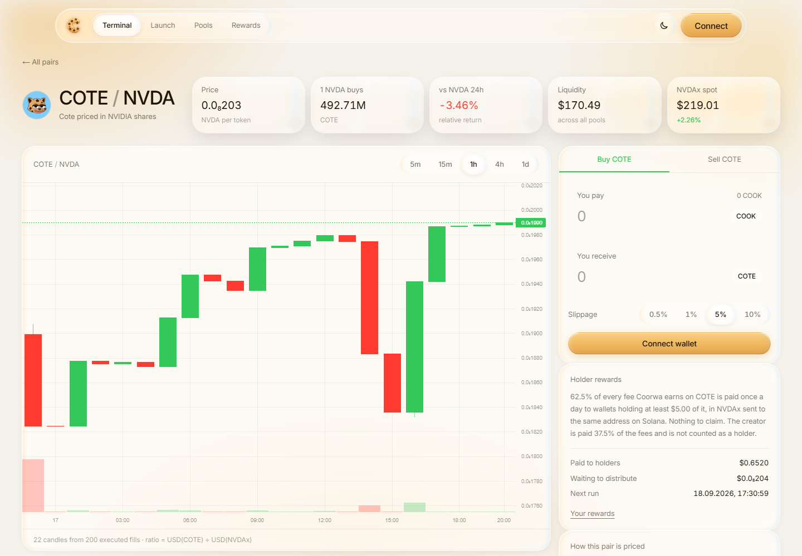
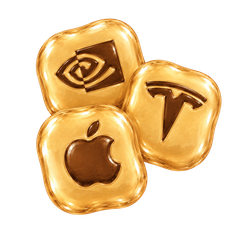
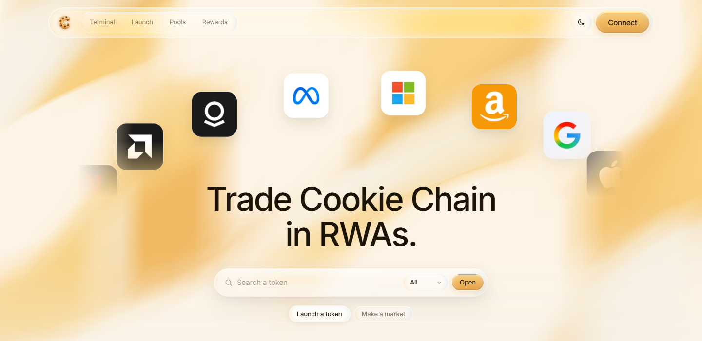
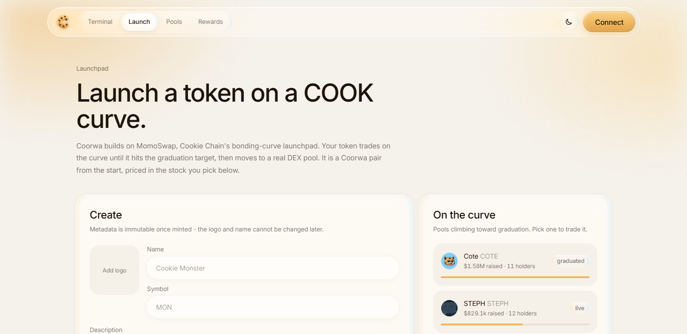
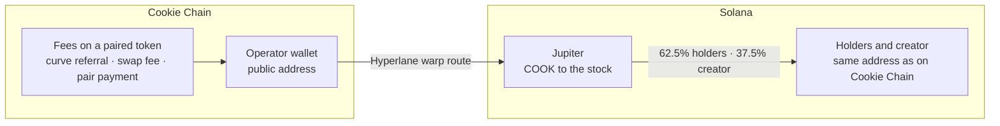

<p align="center">
  
</p>

<h3 align="center">Real-world assets for Cookie Chain.</h3>

<p align="center">
  Every token paired with a real stock. Priced in it, charted in it, and paid out in it.
</p>

<p align="center">
  <a href="https://coorwa.fun"><b>Open the app</b></a>
  &nbsp;·&nbsp;
  <a href="#get-started-in-five-steps">Get started</a>
  &nbsp;·&nbsp;
  <a href="#two-chains-one-wallet">Two chains, one wallet</a>
  &nbsp;·&nbsp;
  <a href="#how-holders-get-paid">How holders get paid</a>
  &nbsp;·&nbsp;
  <a href="#run-it-yourself">Run it yourself</a>
</p>

<p align="center">
  <a href="https://coorwa.fun"></a>
  
  
  
  
  <a href="LICENSE"></a>
</p>

---

Cookie Chain has tokens, bonding curves and pools. **Coorwa gives it real-world assets.**

Every token on Coorwa has one of 16 tokenized stocks as its pair: NVDA, TSLA, AAPL, MSFT, GOOGL,
AMZN, META, NFLX, AMD, PLTR, COIN, HOOD, MSTR, CRCL, SPY or QQQ. The token is quoted in that stock,
charted against it, and its holders are paid in it. Once a day Coorwa takes the fees the token
earned, buys the stock and sends it to every holder's own wallet. Nothing to claim.

- **Launch a token with a stock attached.** Pick NVDA at launch and your token is TOKEN/NVDA from
  its first trade.
- **Or give an existing token its pair.** Its creator picks the stock once, for $1.
- **Hold it and get paid in shares.** 62.5% of every fee goes to holders, 37.5% to the creator.
  Coorwa keeps none of it.

<p align="center">
  
</p>

---

## Two chains, one wallet

Coorwa uses each chain for what it does best. **Cookie Chain** is where tokens launch, trade and
build communities. **Solana** is where tokenized stocks already have an issuer, real liquidity and
holders. Coorwa connects the two, so a Cookie Chain token pays out in real shares today, instead of
waiting for a stock market to be rebuilt from zero on a new chain.

A pair is two live markets divided, a real Cookie Chain pool over real Solana liquidity:

```
price(TOKEN in NVDA) = usd(TOKEN) ÷ usd(NVDAx)
```

| Why Solana | What it gives Cookie Chain |
| --- | --- |
| **The stocks already exist** | xStocks are issued on Solana by Backed Finance and trade with live liquidity on Jupiter. Coorwa buys the real token there instead of minting an imitation. |
| **Your address is the same on both** | Cookie Chain runs the Solana VM, so the ed25519 key you hold a token with is also your Solana address. The stock lands in a wallet you already own: no second wallet, no sign-up, no linking step. |
| **The bridge is already there** | COOK crosses over Cookie Chain's Hyperlane warp route. Coorwa checks the far side of the route before any COOK leaves. |
| **Any Solana wallet works** | Nightly, Backpack, Solflare and Phantom sign for Cookie Chain unchanged. Only the RPC differs. |

### Real shares, not wrapped copies

Every xStock is a Token-2022 mint that carries issuer controls. Read straight from the mint
accounts:

| Extension | State | What it would do to a wrapped copy |
| --- | --- | --- |
| `permanentDelegate` | set | The issuer can move tokens out of **any** account, a bridge escrow included |
| `pausableConfig` | `paused: false` | Transfers can be halted globally, freezing anything in flight |
| `freezeAuthority` | set | Single accounts, an escrow included, can be frozen |
| `scaledUiAmountConfig` | live multiplier | **The token rebases.** A wrapper that locks raw units drifts off its backing |
| `transferHook` | `programId: null` | Off today, but the authority exists to switch it on |

A wrapped copy on Cookie Chain would be an IOU that drifts the first time the multiplier moves.
Coorwa delivers the token itself, so holders end up with exactly the asset Backed issued, rebases
included, in their own wallet.

### Ready for RWAs on Cookie Chain

Pairs, holder samples and the rewards ledger all count in USD. A stock amount is worked out only at
the moment of payout, because xStocks rebase and a debt kept in their units would change value on
its own. Solana does exactly two jobs in Coorwa: **pricing the stock** (Jupiter) and **delivering
it** (bridge, Jupiter buy, send). The day tokenized stocks trade on Cookie Chain itself, those two
jobs are what changes. The terminal, the pairs, the launchpad and the holder accounting stay as they
are.

---

## What you can do

<table>
  <tr>
    <td width="50%" valign="top">
      
      <h3>Terminal</h3>
      <ul>
        <li>Every paired token, priced in its stock: the token's USD price from real Cookie Chain reserves, divided by the xStock's from real Solana liquidity. Nothing is modelled, so the number is exact.</li>
        <li>Candles built from executed fills, not standing quotes, so the chart is genuine performance against the stock.</li>
        <li>Swaps quoted on both Cookie Chain routers, Cookiebox and Candy Shop. The better fill wins.</li>
        <li>A pair that has not traded in 24 hours shows no return, never a fake one from a flat price against a moving stock.</li>
      </ul>
    </td>
    <td width="50%" valign="top">
      
      <h3>Launchpad</h3>
      <ul>
        <li>Launch on a COOK bonding curve through MomoSwap and pick your token's stock at launch, for free.</li>
        <li>The pair is recorded only after the launch transaction is read back from the chain and found to name that mint, so nobody can pin a token they did not create.</li>
        <li>Buy and sell on any curve, priced before you sign. Coorwa rebuilds the curve from the pool's own reserves and matches settled fills to the raw unit.</li>
        <li>Creators claim their curve fees in COOK, or take them as their token's stock on Solana.</li>
      </ul>
    </td>
  </tr>
  <tr>
    <td width="50%" valign="top">
      
      <h3>LP maker</h3>
      <ul>
        <li>Every pair, with the real TOKEN/COOK pool behind it and its depth in shares.</li>
        <li>Cookiebox DAMM v2 positions managed natively: deposit, claim fees, withdraw, built against the fork's own program and IDL.</li>
        <li>LP fees can be paid out as a stock on Solana.</li>
        <li>Positions are found from the position NFTs in your wallet. Coorwa keeps no records of its own.</li>
      </ul>
    </td>
    <td width="50%" valign="top">
      
      <h3>Holder rewards</h3>
      <ul>
        <li>Hold a token and get paid in its stock, every day, with nothing to claim.</li>
        <li>62.5% of every fee to holders, 37.5% to the creator. The creator is never also counted as a holder.</li>
        <li>Holders are sampled at random moments through the day, so a snapshot cannot be timed.</li>
        <li>The rewards page shows every token's waiting pool and the next run, and a connected wallet sees what is coming to it.</li>
      </ul>
    </td>
  </tr>
</table>

<p align="center">
  
  
</p>

---

## Get started in five steps

COOK is the gas token on Cookie Chain and the currency every Coorwa trade and launch runs on. It
also lives on Solana, and Cookie Chain's own bridge moves it between the two.

1. **Get a wallet.** Install [Nightly](https://nightly.app), the wallet Cookie Chain recommends.
   Backpack, Solflare and Phantom work too. One wallet covers both chains, because the address is
   the same on each.
2. **Buy COOK on Solana.** Swap SOL for COOK on [Jupiter](https://jup.ag). COOK's mint on Solana is
   [`36ZrtQoab5MhhySaP1YSTwUahSk6GRVUTtZ6cuVfm9e1`](https://solscan.io/token/36ZrtQoab5MhhySaP1YSTwUahSk6GRVUTtZ6cuVfm9e1).
3. **Bridge it to Cookie Chain.** Open the [Cookie Chain Bridge](https://hyperlane.cookiescan.io),
   connect the same wallet, choose Solana to Cookie Chain and send. COOK is locked on Solana and
   released 1:1 on Cookie Chain within seconds. Keep a little SOL in the wallet for the Solana side's
   fees.
4. **Open [Coorwa](https://coorwa.fun) and connect.** Trade a pair on the terminal,
   buy a token on its curve, or launch your own with a stock attached.
5. **Hold, and get paid on Solana.** Rewards arrive as the token's stock at your same address on
   Solana, already in the wallet you use. There is nothing to claim and nothing to bridge back. To
   move COOK home later, the same bridge runs Cookie Chain to Solana.

---

## How holders get paid

Every fee Coorwa earns on a token forms that token's pool. Fees on CHAT go to CHAT's holders and
CHAT's creator, and to nobody else.

| Source | Rate | Who pays |
| --- | --- | --- |
| Launchpad curve buy | 0.2% of the trade | Nobody extra. It is MomoSwap's referral share of its 1% curve fee, which MomoSwap keeps when no referrer is named |
| Terminal swap | 1% of the COOK leg | The trader, shown on the panel before signing |
| Setting a token's pair | $1, once | The token's creator. All of it goes to holders |



### The daily run

A run starts a day after the first holder sample since the last one and moves one step at a time,
because it spans two chains and a bridge that takes minutes (`src/lib/payout-cycle.ts`):

1. **Allocate.** Each token's pool is shared over its holders by the day's samples, plus the
   creator's share, as one line per wallet per stock (`src/lib/rewards-ledger.ts`).
2. **Bridge.** The run budgets its Solana costs, unwraps any wrapped COOK and bridges what it needs
   over the Hyperlane warp route, keeping a small reserve on Cookie Chain.
3. **Swap.** Jupiter turns the COOK into SOL for costs and into each stock being paid, in proportion
   to what is owed in each.
4. **Send.** Each stock is split over its wallets in whole units, with no unit created or lost, five
   wallets per transaction, opening token accounts where needed.
5. **Done.** What the run really spent is measured and published next to it.

Every transaction is written to the database before it is sent, so a step that dies halfway is
checked against the chain on the next call instead of paying twice.

### Fair by design

- **Random sampling.** A scheduler calls the app every five minutes and the app rolls a die: never
  two samples within 30 minutes, always one within two hours, otherwise a 15% chance. That lands a
  sample about once an hour at a minute nobody can predict. A wallet that buys before one sample and
  sells after it weighs one sample against a holder's whole day.
- **Real holders only.** Balances are read from the chain under both token programs, and for a
  token still on its curve, from curve shares. Program-owned accounts (pool vaults, curves,
  escrows) and Coorwa's own wallet are dropped, and a wallet needs at least $5 of the token.
- **No dust payouts.** A wallet is paid once it is owed $1 in a stock, since the first payout opens
  a token account on Solana. Anything smaller carries over to the next run.
- **Open books.** Fees wait in one operator wallet,
  [`3y5zHNgQ…Pt8R`](https://cookiescan.io/account/3y5zHNgQRSqnjxGSP8TpPoRdixQLEfes7qSqRDejPt8R),
  between collection and the daily run, the same model StonkFun uses, because buying a stock on
  Solana needs a key to sign it. Every run, with its total, its costs, how many wallets it paid and
  its bridge transaction, is published at [`/api/rewards`](https://coorwa.fun/api/rewards), and each payout
  on the rewards page links its Solana transaction.

---

## Built to be trusted

**Coorwa never co-signs a user's transaction and never holds a user's tokens.** Every transaction is
built by an upstream service or by Coorwa's own instruction builders, simulated, then signed in the
user's own wallet.

- **The wallet signs what the user asked for.** Every MomoSwap build (launch, buy, sell, creator fee
  claim) is checked in the browser on the exact bytes about to be signed (`src/lib/expectation.ts`).
  First against MomoSwap's own declaration of what it built, then against the user's request: only
  five programs allowed, COOK may only move into the wallet's own wrapped COOK account and never
  more than the trade spends, no token transfers or approvals, the amount, pool, referrer, name and
  symbol must match, and no priority fee above 0.001 COOK. Anything else stops with a sentence
  saying what differed. Tested on six captured MomoSwap responses and tampered copies of them.
- **Nothing is credited on the client's word.** A reported trade is re-read on chain before it is
  written: it has to exist, to have succeeded, and to be signed by the wallet being credited. A
  referral fee counts only when Coorwa is named on the transaction, and a swap fee is whatever the
  transaction really paid (`src/lib/onchain.ts`).
- **The swap fee is in plain sight.** Neither Cookie Chain router pays a referrer, so Coorwa appends
  one COOK transfer to the router's own transaction, server side, and shows it on the panel before
  signing. A route too long to carry it within the 1,232-byte limit goes through without the fee
  rather than failing.
- **Bridge transfers are checked before they leave.** Two checks that a simulation cannot catch run
  before any COOK moves. The warp route releases from a fixed collateral account, so its balance on the far side is
  read first. And the recipient's token account is created up front, because the route's own rent
  payer is funded once and a dry one makes delivery hang silently.
- **Routes resume from the middle.** A cross-chain payout is written to storage leg by leg, so a
  rejected signature, a closed tab or a browser restart picks up where it stopped, with the COOK
  already on the other chain (`src/lib/journey.ts`).
- **Checked against the live network.** Every address in `src/lib/config.ts` was verified on chain:
  the bridge PDAs match the published collateral accounts, the transfer instruction encodes to
  exactly 77 bytes, the DAMM v2 vault PDAs match real pools, and every xStock was read from its own
  mint account.

---

## Under the hood

**Stack.** Next.js 16 and React 19 on Cloudflare Workers through OpenNext, Postgres (Neon) through
Hyperdrive with drizzle, `@solana/web3.js` and Anchor, TradingView lightweight-charts, a holder
sampler Worker, and 102 offline unit tests that run in about two seconds.

**Coorwa's own program on Cookie Chain.** `programs/corwa-vault` is an Anchor merkle distributor
Coorwa wrote and deployed on Cookie Chain at
[`83cPao5i…ywdYg`](https://cookiescan.io/account/83cPao5iemCJ6dj9ni7KXGo7JCVHtQu2jfMVuD7ywdYg). Its
toolchain is pinned in a container, and `npm run program:test` exercises it against a real
validator: claims, double claims, claiming someone else's line, forged proofs, epochs the vault
cannot back, and publishing from the wrong key. It was Coorwa's claim-based payout path before
daily payouts replaced claims.

```
src/
  lib/
    pairs.ts          The pair engine: the ratio and the relative-return maths
    rwa.ts            The 16 xStocks, read from their own mint accounts
    candles.ts        Candles from executed fills, the stock series and the ratio series
    swap.ts           Both Cookie Chain routers, quoted head to head
    swap-fee.ts       Coorwa's fee, appended to the router's transaction or dropped if it will not fit
    launchpad.ts      MomoSwap client
    curve.ts          Bonding-curve pricing, free of the network so the browser can quote a fill
    expectation.ts    A launchpad transaction checked against what was asked for, before signing
    launches.ts       Tokens launched here and the stock each creator picked
    listings.ts       The one pair a creator sets for a token launched elsewhere, priced and proved
    creators.ts       Who made a token, from the launch record or the mint's metadata authority
    liquidity.ts      Cookiebox DAMM v2, built against the fork's IDL
    holders.ts        Who holds a token right now, read from the chain and filtered to real wallets
    holder-samples.ts Random holder samples, and a pool shared by what each wallet held
    rewards-ledger.ts Who is owed what in which stock, and what has been paid
    payout-cycle.ts   The daily run: bridge, swap on Jupiter, send to holders on Solana
    crosschain.ts     The three-leg route planner, both directions, with measured slippage per leg
    crosschain-exec.ts The executor: signs the legs and resumes a route from the middle
    bridge.ts         Hyperlane warp route, hand-encoded, with the two preflight checks
    jupiter.ts        Stock prices and the Solana leg of a route
    onchain.ts        Proving a reported transaction really happened before anything is written down
    tx.ts             Simulate, sign, send, confirm
  app/api/            Server routes: every rate-limited upstream call is proxied and cached here
  components/         UI

programs/corwa-vault/ The Anchor program, with its committed IDL checked against the client in tests
workers/holder-sampler/ Worker that asks the app for a holder sample every five minutes
tests/                Unit tests, offline; integration/ runs the program against a real validator
```

---

## Run it yourself

```bash
npm install
npm run dev
```

Open <http://localhost:3000>. Chain data needs no keys: the Cookie Chain RPC, both routers, the
launchpad and the token registry are all public. Pairs, fills and rewards live in Postgres. Put
these in `.env.local`:

| Variable | What it enables |
| --- | --- |
| `DATABASE_URL` | Pairs, fills and rewards. Create the tables with `npm run db:push` |
| `NEXT_PUBLIC_SOLANA_RPC_URL` | Solana legs in the browser. The public Solana RPC refuses browser requests, so use a provider such as Helius |
| `SOLANA_SERVER_RPC_URL` | Solana RPC for server code (payouts, payment checks). Server only; set it when the public key above is locked to your domains, since server requests carry no domain. Defaults to the public one |
| `NEXT_PUBLIC_COORWA_OPERATOR` | The operator wallet's public address, which receives fees and pays holders |
| `COORWA_OPERATOR_KEY` | The operator keypair (base58 or JSON array). Server only; without it payout runs stay off |
| `HOLDER_SAMPLE_SECRET` | Bearer secret for `POST /api/cashback/sample`, the holder sampler's endpoint |
| `COORWA_REFERRER` | Launchpad referrer, defaults to the operator |
| `NEXT_PUBLIC_COOKIE_RPC_URL` | Cookie Chain RPC, defaults to `https://rpc.cookiescan.io` |
| `JUPITER_API_KEY` | Optional, raises Jupiter rate limits |

```bash
npm run test        # 102 offline unit tests
npm run typecheck
npm run build
```

### Deploying to Cloudflare

The app runs on Cloudflare Workers through the OpenNext adapter (`wrangler.jsonc`,
`open-next.config.ts`). The database is reached through Hyperdrive, so each request opens its own
client over warm connections. Replace the `hyperdrive` id with your own
(`npx wrangler hyperdrive create <name> --connection-string <url>`, using Neon's direct host, not the
`-pooler` one).

```bash
npx wrangler secret put HOLDER_SAMPLE_SECRET   # any long random string
npx wrangler secret put COORWA_OPERATOR_KEY    # the operator keypair
npx wrangler secret put SOLANA_SERVER_RPC_URL  # Solana RPC without domain rules
npx wrangler secret put JUPITER_API_KEY        # optional
npm run deploy                                 # builds, then uploads
```

`NEXT_PUBLIC_*` values are baked into the bundle at build time, so they come from `.env.local` on the
machine that builds. `npm run preview` runs the built Worker locally.

Holder samples need something to `POST /api/cashback/sample` every five minutes with
`authorization: Bearer <HOLDER_SAMPLE_SECRET>`. `workers/holder-sampler` does it from a cron trigger
through a service binding to the app, and any external scheduler works the same way.

### The program

The program needs a specific Rust, Agave and Anchor, so all three are pinned in a container image.
The only requirement is Docker:

```bash
npm run program:build    # compile, and copy the IDL to programs/corwa-vault/idl.json
npm run program:test     # integration tests against a throwaway validator
```

---

## Built on

[Cookie Chain](https://www.cookiechain.wtf) ·
[Cookiescan](https://cookiescan.io) ·
[Cookiebox](https://cookiebox.app) ·
[Candy Shop](https://swap.cookiescan.io) ·
[MomoSwap](https://momoswap.fun) ·
[Hyperlane](https://hyperlane.cookiescan.io) ·
[Jupiter](https://jup.ag) ·
[xStocks by Backed](https://xstocks.com)

Reference implementations for several on-chain flows come from
[`cookiechain/cookie-mcp`](https://github.com/cookiechain/cookie-mcp).

Made by [Vicape7](https://github.com/Vicape7) · [@xVicape](https://x.com/xVicape) · Open source
under the [MIT license](LICENSE)

---

<sub>Coorwa never holds your tokens and never signs for you. Fees wait in its operator wallet until
the daily run pays them out. Tokens on Cookie Chain are volatile and can lose all their value,
tokenized stocks carry issuer risk of their own, and rewards are not guaranteed. Nothing here is
investment advice.</sub>
