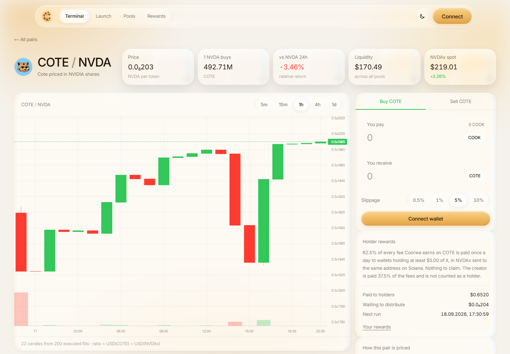
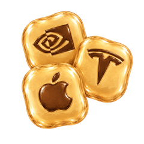
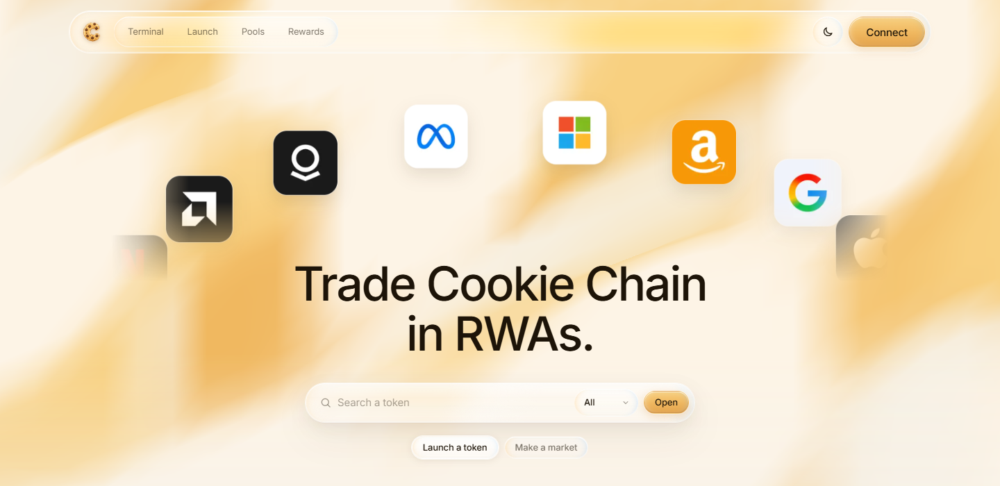
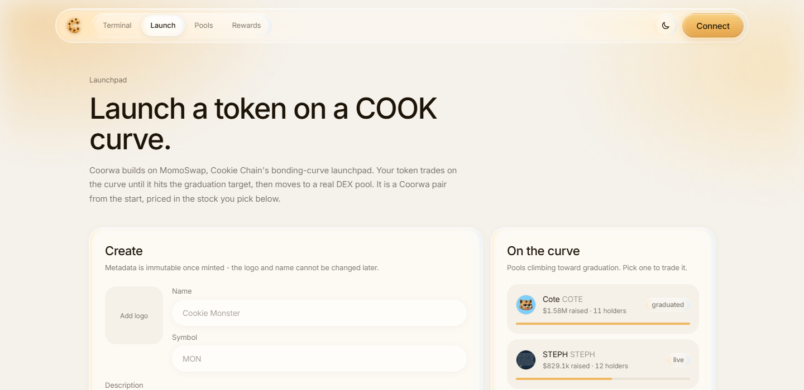
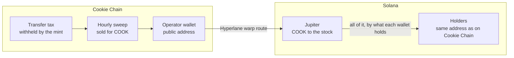

<p align="center">
  
</p>

<h3 align="center">Real-world assets for Cookie Chain.</h3>

<p align="center">
  Every token paired with a real stock. Priced in it, charted in it, and paid out in it.
</p>

<p align="center">
  <a href="https://coorwa.fun"><b>Open the app</b></a>
  &nbsp;·&nbsp;
  <a href="#get-started-in-five-steps">Get started</a>
  &nbsp;·&nbsp;
  <a href="#two-chains-one-wallet">Two chains, one wallet</a>
  &nbsp;·&nbsp;
  <a href="#how-holders-get-paid">How holders get paid</a>
  &nbsp;·&nbsp;
  <a href="#run-it-yourself">Run it yourself</a>
</p>

<p align="center">
  <a href="https://coorwa.fun"></a>
  
  
  
  
  <a href="LICENSE"></a>
</p>

---

Cookie Chain has tokens, bonding curves and pools. **Coorwa gives it real-world assets.**

Every token on Coorwa has one of 16 tokenized stocks as its pair: NVDA, TSLA, AAPL, MSFT, GOOGL,
AMZN, META, NFLX, AMD, PLTR, COIN, HOOD, MSTR, CRCL, SPY or QQQ. The token is quoted in that stock,
charted against it, and its holders are paid in it. Every token launched on Coorwa carries a
transfer tax of 1, 2 or 3%, and once a day Coorwa turns that tax into the stock and sends it to
every holder's own wallet. Nothing to claim.

- **Launch a token with a stock attached.** Pick NVDA and a tax at launch and your token is
  TOKEN/NVDA from its first trade. Neither can ever change.
- **Hold it and get paid in shares.** The tax is charged on every transfer, wherever the token
  trades, and all of it goes to the token's holders, the wallet that created it among them, by how
  much each one holds. Coorwa keeps none of it.

<p align="center">
  
</p>

---

## Two chains, one wallet

Coorwa uses each chain for what it does best. **Cookie Chain** is where tokens launch, trade and
build communities. **Solana** is where tokenized stocks already have an issuer, real liquidity and
holders. Coorwa connects the two, so a Cookie Chain token pays out in real shares today, instead of
waiting for a stock market to be rebuilt from zero on a new chain.

A pair is two live markets divided, a real Cookie Chain pool over real Solana liquidity:

```
price(TOKEN in NVDA) = usd(TOKEN) ÷ usd(NVDAx)
```

| Why Solana | What it gives Cookie Chain |
| --- | --- |
| **The stocks already exist** | xStocks are issued on Solana by Backed Finance and trade with live liquidity on Jupiter. Coorwa buys the real token there instead of minting an imitation. |
| **Your address is the same on both** | Cookie Chain runs the Solana VM, so the ed25519 key you hold a token with is also your Solana address. The stock lands in a wallet you already own: no second wallet, no sign-up, no linking step. |
| **The bridge is already there** | COOK crosses over Cookie Chain's Hyperlane warp route. Coorwa checks the far side of the route before any COOK leaves. |
| **Any Solana wallet works** | Nightly, Backpack, Solflare and Phantom sign for Cookie Chain unchanged. Only the RPC differs. |

### Real shares, not wrapped copies

Every xStock is a Token-2022 mint that carries issuer controls. Read straight from the mint
accounts:

| Extension | State | What it would do to a wrapped copy |
| --- | --- | --- |
| `permanentDelegate` | set | The issuer can move tokens out of **any** account, a bridge escrow included |
| `pausableConfig` | `paused: false` | Transfers can be halted globally, freezing anything in flight |
| `freezeAuthority` | set | Single accounts, an escrow included, can be frozen |
| `scaledUiAmountConfig` | live multiplier | **The token rebases.** A wrapper that locks raw units drifts off its backing |
| `transferHook` | `programId: null` | Off today, but the authority exists to switch it on |

A wrapped copy on Cookie Chain would be an IOU that drifts the first time the multiplier moves.
Coorwa delivers the token itself, so holders end up with exactly the asset Backed issued, rebases
included, in their own wallet.

### Ready for RWAs on Cookie Chain

Pairs, holder samples and the rewards ledger all count in USD. A stock amount is worked out only at
the moment of payout, because xStocks rebase and a debt kept in their units would change value on
its own. Solana does exactly two jobs in Coorwa: **pricing the stock** (Jupiter) and **delivering
it** (bridge, Jupiter buy, send). The day tokenized stocks trade on Cookie Chain itself, those two
jobs are what changes. The terminal, the pairs, the launchpad and the holder accounting stay as they
are.

---

## What you can do

<table>
  <tr>
    <td width="50%" valign="top">
      
      <h3>Terminal</h3>
      <ul>
        <li>Every paired token, priced in its stock: the token's USD price from real Cookie Chain reserves, divided by the xStock's from real Solana liquidity. Nothing is modelled.</li>
        <li>Candles built from executed fills, not standing quotes, so the chart is genuine performance against the stock.</li>
        <li>Swaps quoted on both Cookie Chain routers, Cookiebox and Candy Shop. The better fill wins.</li>
        <li>A pair that has not traded in 24 hours shows no return, never a fake one from a flat price against a moving stock.</li>
        <li>New, Soon and Migrated: launches still on their curve, those past 60% of graduation, and pairs trading in a real pool, each tab with its own sort. A curve pair has its own page too, priced from the curve's reserves and traded on the curve. A graduated curve shows as migrating until its pool is live, and its page switches to trading the pool by itself.</li>
        <li>Coorwa curves and pools are charted from the program's own events, one per fill, with the amounts it actually moved.</li>
      </ul>
    </td>
    <td width="50%" valign="top">
      
      <h3>Launchpad</h3>
      <ul>
        <li>Launch on Coorwa's own program: pick the token's stock and a transfer tax of 1, 2 or 3%, with an optional first buy in the same transaction. Both choices are fixed for good.</li>
        <li>One billion tokens, 800 million sold on a COOK bonding curve. At 1,000,000 COOK raised the program opens a Cookiebox pool with the other 200 million, locks the liquidity forever and burns what the curve did not sell. An automated job starts graduation within seconds of the curve filling.</li>
        <li>Buy and sell on the curve, priced before you sign by the same arithmetic the program runs, matched to the unit on real fills.</li>
        <li>The creator earns 40% of what the locked pool earns in fees, paid by the program straight to their wallet, for as long as the pool exists.</li>
        <li>Tokens launched on MomoSwap before Coorwa had its own program keep trading here, and their creators still claim their curve fees on the launch page.</li>
      </ul>
    </td>
  </tr>
  <tr>
    <td width="50%" valign="top">
      
      <h3>Holder rewards</h3>
      <ul>
        <li>Hold a token and get paid in its stock, every day, with nothing to claim.</li>
        <li>A token's whole transfer tax goes to that token's holders, shared by what each wallet holds. A creator takes no separate share of it: they are paid for what they hold, like anyone else.</li>
        <li>Holders are sampled at random moments through the day, so a snapshot cannot be timed.</li>
        <li>The rewards page shows every token's waiting pool and the next run, and a connected wallet sees what is coming to it.</li>
      </ul>
    </td>
  </tr>
</table>

<p align="center">
  
  
</p>

---

## Get started in five steps

COOK is the gas token on Cookie Chain and the currency every Coorwa trade and launch runs on. It
also lives on Solana, and Cookie Chain's own bridge moves it between the two.

1. **Get a wallet.** Install [Nightly](https://nightly.app), the wallet Cookie Chain recommends.
   Backpack, Solflare and Phantom work too. One wallet covers both chains, because the address is
   the same on each.
2. **Buy COOK on Solana.** Swap SOL for COOK on [Jupiter](https://jup.ag). COOK's mint on Solana is
   [`36ZrtQoab5MhhySaP1YSTwUahSk6GRVUTtZ6cuVfm9e1`](https://solscan.io/token/36ZrtQoab5MhhySaP1YSTwUahSk6GRVUTtZ6cuVfm9e1).
3. **Bridge it to Cookie Chain.** Open the [Cookie Chain Bridge](https://hyperlane.cookiescan.io),
   connect the same wallet, choose Solana to Cookie Chain and send. COOK is locked on Solana and
   released 1:1 on Cookie Chain within seconds. Keep a little SOL in the wallet for the Solana side's
   fees.
4. **Open [Coorwa](https://coorwa.fun) and connect.** Trade a pair on the terminal,
   buy a token on its curve, or launch your own with a stock attached.
5. **Hold, and get paid on Solana.** Rewards arrive as the token's stock at your same address on
   Solana, already in the wallet you use. There is nothing to claim and nothing to bridge back. To
   move COOK home later, the same bridge runs Cookie Chain to Solana.

---

## How holders get paid

A token launched on Coorwa pays its holders from its own transfer tax. The mint withholds it on
every transfer, on the curve, in the pool, in another app or between two wallets, so the token
earns for its holders wherever it trades, not only here. The tax on TOKEN goes to TOKEN's holders
and to nobody else.

| Source | Rate | Goes to |
| --- | --- | --- |
| Transfer tax on a Coorwa token | 1, 2 or 3% of every transfer, picked at launch | The token's holders, all of it |
| Buy or sell on a Coorwa curve | 1% of the trade | Coorwa |
| The locked pool after graduation | The pool's own trading fee | 40% the creator, 60% Coorwa |

Tokens launched on MomoSwap before Coorwa had its own program have no tax, so they keep the older
rule: Coorwa's 1% on a terminal swap and MomoSwap's referral share of its curve fee go to their
holders instead.


```mermaid
flowchart LR
  subgraph CC["Cookie Chain"]
    T["Transfer tax<br/>withheld by the mint"]
    S["Hourly sweep<br/>sold for COOK"]
    O["Operator wallet<br/>public address"]
  end
  subgraph SOL["Solana"]
    J["Jupiter<br/>COOK to the stock"]
    H["Holders<br/>same address as on Cookie Chain"]
  end
  T --> S --> O
  O -- "Hyperlane warp route" --> J
  J -- "all of it, by what each wallet holds" --> H
```

### The hourly sweep

Token-2022 does not pay a transfer fee to anyone when it is charged: it is held back inside the
account the tokens landed in, and only the mint's withdraw authority can take it out. Coorwa's
operator wallet is that authority for every token launched here, so once an hour it
(`src/lib/tax-sweep.ts`):

1. **Harvests** the withheld tax out of every holder's account into the mint, which anyone may do.
2. **Withdraws** it from the mint and **sells** all of it for COOK, to the curve or, after
   graduation, to the token's pool, in the same transaction.
3. **Writes** the COOK the sale paid, valued in dollars, as owed to that token's holders.

The sale is written down before it is sent and settled from the chain afterwards, and only one
unsettled sale per token fits in the table, so a pass that dies halfway cannot sell twice. The same
pass then claims Coorwa's curve and pool fees for the token (`src/lib/fee-claims.ts`) into a wallet
of their own, apart from the operator.

### The daily run

A run starts a day after the first holder sample since the last one and moves one step at a time,
because it spans two chains and a bridge that takes minutes (`src/lib/payout-cycle.ts`):

1. **Allocate.** Each token's pool is shared over its holders by the day's samples, as one line
   per wallet per stock (`src/lib/rewards-ledger.ts`).
2. **Bridge.** The run budgets its Solana costs, unwraps any wrapped COOK and bridges what it owes
   over the Hyperlane warp route, keeping a small reserve on Cookie Chain. Costs are paid from the
   operator's spare SOL first, and what that does not cover comes out of this run's own payouts,
   never out of another token's waiting pool.
3. **Swap.** Jupiter turns the COOK into SOL for costs and into each stock being paid, in proportion
   to what is owed in each.
4. **Send.** Each stock is split over its wallets in whole units, with no unit created or lost, five
   wallets per transaction, opening token accounts where needed.
5. **Done.** What the run really spent is measured and published next to it.

Every transaction is written to the database before it is sent, so a step that dies halfway is
checked against the chain on the next call instead of paying twice.

### Fair by design

- **Random sampling.** A scheduler calls the app every five minutes and the app rolls a die: never
  two samples within 30 minutes, always one within two hours, otherwise a 15% chance. That lands a
  sample about once an hour at a minute nobody can predict. A wallet that buys before one sample and
  sells after it weighs one sample against a holder's whole day.
- **Real holders only.** Balances are read from the chain under both token programs. A Coorwa curve
  delivers the token to the buyer's own wallet on every buy, so its holders are real from the first
  trade. Program-owned accounts (pool vaults, curves, escrows) and Coorwa's own wallets are dropped,
  and a wallet needs at least $5 of the token.
- **No dust payouts.** A wallet is paid once it is owed $1 in a stock, since the first payout opens
  a token account on Solana. Anything smaller carries over to the next run.
- **Open books.** The tax and fees owed to holders wait in one operator wallet,
  [`3y5zHNgQ…Pt8R`](https://cookiescan.io/address/3y5zHNgQRSqnjxGSP8TpPoRdixQLEfes7qSqRDejPt8R),
  between collection and the daily run, because buying a stock on
  Solana needs a key to sign it. Every run, with its total, its costs, how many wallets it paid and
  its bridge transaction, is published at [`/api/rewards`](https://coorwa.fun/api/rewards), and each payout
  on the rewards page links its Solana transaction.

---

## Built to be trusted

**Coorwa never co-signs a user's transaction and never holds a user's tokens.** Every transaction is
built by an upstream service or by Coorwa's own instruction builders, simulated, then signed in the
user's own wallet.

- **The launch program keeps its promises on chain, not on a web page.** Each one is something a
  buyer can check on the mint or the program rather than take on trust
  (`programs/corwa-launch`):
  - *The tax can never change.* The mint's transfer fee authority is set to none the moment the
    mint is created, not renounced later, so there is no window in which anyone could raise it.
  - *The supply is fixed and the mint is sealed.* The whole supply is minted once, in the launch
    instruction, and the mint authority is dropped before it returns. There is no freeze authority
    and no permanent delegate, so nobody can mint, freeze or seize.
  - *The curve cannot be drained.* COOK only leaves a curve through a sell, priced by the same
    invariant that let it in, and the program's fees are counted apart from the reserve, so
    claiming them can never eat into what sellers are owed.
  - *The pool is locked for good.* Graduation opens the Cookiebox pool itself, locks the whole
    position and burns the tokens the curve did not sell. If someone opened the token's pool first,
    the program swaps it back to the curve's closing price, refuses anything more than 1% off, and
    requires at least 99.5% of one side to go into the pool.

  What Coorwa still holds is the program's upgrade authority and the right to pause new launches.
  The upgrade authority will be given up once the program has run quietly for a while.
- **The wallet signs what the user asked for.** Coorwa curve trades are built in the browser from the
  program's own instruction builders and quoted by the same arithmetic the program runs. For tokens
  launched on MomoSwap, every MomoSwap build (buy, sell, creator fee claim) is checked in the
  browser on the exact bytes about to be signed (`src/lib/expectation.ts`). First against
  MomoSwap's own declaration of what it built, then against the user's request: only
  five programs allowed, COOK may only move into the wallet's own wrapped COOK account and never
  more than the trade spends, no token transfers or approvals, the amount, pool, referrer, name and
  symbol must match, and no priority fee above 0.001 COOK. Anything else stops with a sentence
  saying what differed. Tested on six captured MomoSwap responses and tampered copies of them.
- **The swaps that cannot be read that way are judged by what they do.** An aggregator route through
  half a dozen pools has no shape worth pinning, so those builds are simulated first and read by
  their effect on the three balances the trade is about: the trade may spend no more than it is for,
  it has to return at least what the quote promised with Coorwa's own fee accounted for, and the
  wallet's native balance may fall by no more than fees and one account's rent. The two token
  accounts must also stay under the wallet's control: a build that approves another key to spend
  one later, or hands it or the right to close it to someone else, is refused
  (`src/lib/swap-check.ts`). Terminal swaps, both swap legs of a cross-chain route and the payout
  run's own Jupiter builds go through the same rule, so the operator wallet signs no more blindly
  than a user does. A build that fails any of it, or that will not simulate at all, is refused
  rather than signed.
- **Nothing is credited on the client's word.** A reported trade is re-read on chain before it is
  written: it has to exist, to have succeeded, and to be signed by the wallet reporting it. Which
  token it traded is read from the transaction too, from the balance that moved for a swap and from
  the launchpad's own instruction for a curve fill, so a fill cannot be pointed at a token it never
  touched. A Coorwa curve fill is read from the program's own `Traded` event, which carries the
  amounts it actually moved. Every fee is measured rather than worked out: a swap fee is the COOK
  that reached the operator, a referral is the wrapped COOK that reached it, and a transaction that merely names
  Coorwa has paid it nothing (`src/lib/onchain.ts`, `src/app/api/rewards/record/route.ts`).
- **The swap fee is in plain sight.** Neither Cookie Chain router pays a referrer, so Coorwa appends
  one COOK transfer to the router's own transaction, server side, and shows it on the panel before
  signing. A route too long to carry it within the 1,232-byte limit goes through without the fee
  rather than failing.
- **Bridge transfers are checked before they leave.** Two checks that a simulation cannot catch run
  before any COOK moves. The warp route releases from a fixed collateral account, so its balance on the far side is
  read first. And the recipient's token account is created up front, because the route's own rent
  payer is funded once and a dry one makes delivery hang silently.
- **Routes resume from the middle.** A cross-chain payout is written to storage leg by leg, so a
  rejected signature, a closed tab or a browser restart picks up where it stopped, with the COOK
  already on the other chain (`src/lib/journey.ts`).
- **No RPC key in the page.** Solana needs a keyed endpoint, and a key shipped to a browser is a
  public key whatever domain rules it carries, because a rule only stops other websites and not a
  script that sets the header itself. So the browser calls Coorwa's own relay instead
  (`src/app/api/solana-rpc/route.ts`), which passes on a short list of read and send calls and adds
  the key server side.
- **Checked against the live network.** Every address in `src/lib/config.ts` was verified on chain:
  the bridge PDAs match the published collateral accounts, the transfer instruction encodes to
  exactly 77 bytes, the DAMM v2 vault PDAs match real pools, and every xStock was read from its own
  mint account.

---

## Under the hood

**Stack.** Next.js 16 and React 19 on Cloudflare Workers through OpenNext, Postgres (Neon) through
Hyperdrive with drizzle, `@solana/web3.js` and Anchor, TradingView lightweight-charts, a holder
sampler Worker, 198 offline unit tests that run in a few seconds, and integration tests that run
both programs against a real validator.

**Coorwa's launch program on Cookie Chain.** `programs/corwa-launch` is the Anchor program every
token on Coorwa launches from, deployed at
[`DT7Jds9L…zxuvZq`](https://cookiescan.io/address/DT7Jds9LADV82pdKyDBcYPDfb7vaKvHcbyEG48zxuvZq). It
mints the taxed Token-2022 token, runs the curve, graduates into a locked Cookiebox pool and splits
that pool's fees. Its toolchain is pinned in a container, and `npm run program:test` runs it against
a real validator with the real Cookiebox pool program loaded: launches, buys and sells with the tax
live, graduation, fee claims, and a pool opened early by somebody else
(`tests/integration/launch.test.ts`, `squat.test.ts`). Its config (curve shape, target, tax tiers,
where fees go) is written by `npm run launch:config` from `src/lib/launch-params.ts`, so the app and
the chain read the same numbers.

**The older vault program.** `programs/corwa-vault` is an Anchor merkle distributor Coorwa deployed
at [`83cPao5i…ywdYg`](https://cookiescan.io/address/83cPao5iemCJ6dj9ni7KXGo7JCVHtQu2jfMVuD7ywdYg),
Coorwa's claim-based payout path before daily payouts replaced claims. Its tests cover claims,
double claims, claiming someone else's line, forged proofs, epochs the vault cannot back, and
publishing from the wrong key.

Nothing in the app calls it today. The deployed vault still holds 15,895 COOK, about a dollar: one
early pair payment from before payouts moved to the operator wallet, and a 10 COOK test deposit. It
is kept here because it is Coorwa's own on-chain work, not because anything depends on it. It has no
withdrawal instruction by design, so tokens sent to it can only come back out through a published
epoch that names the sender: do not fund it.

```
src/
  lib/
    pairs.ts          The pair engine: the ratio and the relative-return maths
    rwa.ts            The 16 xStocks, read from their own mint accounts
    candles.ts        Candles from executed fills, the stock series and the ratio series
    swap.ts           Both Cookie Chain routers, quoted head to head
    swap-fee.ts       Coorwa's fee, appended to the router's transaction or dropped if it will not fit
    launch-program.ts Client for Coorwa's launch program: instructions, quotes, curves, Traded events
    launch-params.ts  What the program's config is written with
    launch-flow.ts    What the browser builds: a launch, its first buy, curve and pool trades
    launch-metadata.ts A token's name, symbol and image, signed by its creator and hosted on R2
    coorwa-pairs.ts   A Coorwa curve or pool as a pair, priced in its stock
    chain-fills.ts    Fills read from the chain: the program's events and DAMM pool swaps
    tax-sweep.ts      The hourly sweep: withheld tax harvested, sold for COOK, owed to holders
    fee-claims.ts     Coorwa's curve and pool fees, claimed in the same pass
    graduation-crank.ts Starts graduation the moment a curve fills
    launchpad.ts      MomoSwap client, for tokens launched there before
    curve.ts          MomoSwap bonding-curve pricing, free of the network so the browser can quote a fill
    curve-pairs.ts    MomoSwap pairs still on their curve, priced from its reserves
    expectation.ts    A MomoSwap transaction checked against what was asked for, before signing
    swap-check.ts     A swap build judged by what simulating it does to the wallet, before signing
    launches.ts       Tokens launched here and the stock each creator picked
    listings.ts       The two pairs bought before pairing a token from outside was closed
    creators.ts       Who made a token, from the launch record or the mint's metadata authority
    holders.ts        Who holds a token right now, read from the chain and filtered to real wallets
    holder-samples.ts Random holder samples, and a pool shared by what each wallet held
    rewards-ledger.ts Who is owed what in which stock, and what has been paid
    payout-cycle.ts   The daily run: bridge, swap on Jupiter, send to holders on Solana
    crosschain.ts     The three-leg route planner, both directions, with measured slippage per leg
    crosschain-exec.ts The executor: signs the legs and resumes a route from the middle
    bridge.ts         Hyperlane warp route, hand-encoded, with the two preflight checks
    jupiter.ts        Stock prices and the Solana leg of a route
    onchain.ts        Proving a reported transaction really happened before anything is written down
    tx.ts             Simulate, sign, send, confirm
  app/api/            Server routes: every rate-limited upstream call is proxied and cached here
  components/         UI

programs/corwa-launch/ The launch program, with its committed IDL
programs/corwa-vault/ The older vault program, with its committed IDL checked against the client in tests
workers/holder-sampler/ Worker that asks the app for a holder sample every five minutes
tests/                Unit tests, offline; integration/ runs the program against a real validator
```

---

## Run it yourself

```bash
npm install
npm run dev
```

Open <http://localhost:3000>. Chain data needs no keys: the Cookie Chain RPC, both routers, the
launchpad and the token registry are all public. Pairs, fills and rewards live in Postgres. Put
these in `.env.local`:

| Variable | What it enables |
| --- | --- |
| `DATABASE_URL` | Pairs, fills and rewards. Create the tables with `npm run db:push` |
| `SOLANA_SERVER_RPC_URL` | Solana RPC for every Solana call: payouts, payment checks, and the browser's own reads through `/api/solana-rpc`. Server only, never `NEXT_PUBLIC`. Use a provider such as Helius; without it the public endpoint is used, which is heavily throttled |
| `SOLANA_BROWSER_RPC_URL` | Optional second Solana key for the browser relay, so traffic from the site cannot eat the rate limit the payout run needs. Defaults to the one above |
| `NEXT_PUBLIC_COORWA_OPERATOR` | The operator wallet's public address, which sweeps the tax, holds what holders are owed and pays them |
| `COORWA_OPERATOR_KEY` | The operator keypair (base58 or JSON array). Server only; without it the sweep and payout runs stay off |
| `GRADUATION_CRANK` | `on` lets the scheduler graduate a curve the moment it fills. Off otherwise |
| `HOLDER_SAMPLE_SECRET` | Bearer secret for `POST /api/cashback/sample`, the holder sampler's endpoint |
| `COORWA_REFERRER` | Launchpad referrer, defaults to the operator |
| `NEXT_PUBLIC_COOKIE_RPC_URL` | Cookie Chain RPC, defaults to `https://rpc.cookiescan.io` |
| `JUPITER_API_KEY` | Optional, raises Jupiter rate limits |

```bash
npm run test        # 198 offline unit tests
npm run typecheck
npm run build
```

### Deploying to Cloudflare

The app runs on Cloudflare Workers through the OpenNext adapter (`wrangler.jsonc`,
`open-next.config.ts`). The database is reached through Hyperdrive, so each request opens its own
client over warm connections. Replace the `hyperdrive` id with your own
(`npx wrangler hyperdrive create <name> --connection-string <url>`, using Neon's direct host, not the
`-pooler` one).

```bash
npx wrangler secret put HOLDER_SAMPLE_SECRET   # any long random string
npx wrangler secret put COORWA_OPERATOR_KEY    # the operator keypair
npx wrangler secret put SOLANA_SERVER_RPC_URL  # Solana RPC for server code and the browser relay
npx wrangler secret put JUPITER_API_KEY        # optional
npm run deploy                                 # builds, then uploads
```

`NEXT_PUBLIC_*` values are baked into the bundle at build time, so they come from `.env.local` on the
machine that builds. `npm run preview` runs the built Worker locally. Token metadata is stored in an
R2 bucket bound as `METADATA`; under `next dev` it falls back to files in `.coorwa-metadata`.

Holder samples need something to `POST /api/cashback/sample` every five minutes with
`authorization: Bearer <HOLDER_SAMPLE_SECRET>`. `workers/holder-sampler` does it from a cron trigger
through a service binding to the app, and any external scheduler works the same way.

### The program

The program needs a specific Rust, Agave and Anchor, so all three are pinned in a container image.
The only requirement is Docker:

```bash
npm run program:build    # compile both programs, and copy each IDL next to its source
npm run program:test     # integration tests against a throwaway validator
```

Three scripts drive the launch program by hand. Each prints what it would do and sends nothing
without `--send`:

```bash
npm run launch:config              # write the program's config from src/lib/launch-params.ts
npm run launch:graduate -- <mint>  # graduate a filled curve, as the scheduled crank does
npm run launch:claim -- <mint>     # claim a token's curve and pool fees
```

---

## Built on

[Cookie Chain](https://www.cookiechain.wtf) ·
[Cookiescan](https://cookiescan.io) ·
[Cookiebox](https://cookiebox.app) ·
[Candy Shop](https://swap.cookiescan.io) ·
[MomoSwap](https://momoswap.fun) ·
[Hyperlane](https://hyperlane.cookiescan.io) ·
[Jupiter](https://jup.ag) ·
[xStocks by Backed](https://xstocks.com)

Reference implementations for several on-chain flows come from
[`cookiechain/cookie-mcp`](https://github.com/cookiechain/cookie-mcp).

Made by [Vicape7](https://github.com/Vicape7) · [@xVicape](https://x.com/xVicape) · Open source
under the [MIT license](LICENSE)

---

<sub>Coorwa never holds your tokens and never signs for you. The tax and fees owed to holders wait in
its operator wallet until the daily run pays them out. Tokens on Cookie Chain are volatile and can lose all their value,
tokenized stocks carry issuer risk of their own, and rewards are not guaranteed. Nothing here is
investment advice.</sub>
